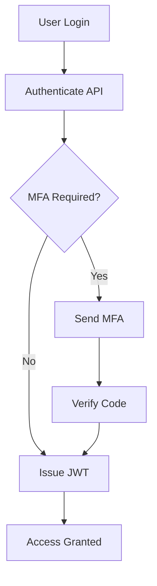

## Overview

IDSMK provides robust identity management solutions tailored for secure authentication and user access control. You integrate it seamlessly into your applications to handle user sessions, API authorizations, and compliance reporting. Key strengths include real-time monitoring, scalable infrastructure, and intuitive dashboards that simplify complex identity workflows.

<Callout kind="info">
  IDSMK supports over `{10,000}` active users daily with `{99.99%}` uptime.
</Callout>

## Core Features

Discover the main functionalities that power IDSMK's 'Main of IDSMK' service.

<Columns cols={3}>
  <Card title="Secure Authentication" icon="shield" href="#authentication">
    Implement OAuth 2.0, JWT tokens, and multi-factor authentication (MFA) to protect your user data.
  </Card>
  <Card title="API Integration" icon="zap" href="#api">
    Access comprehensive RESTful APIs for user provisioning, role management, and audit logs.
  </Card>
  <Card title="Real-Time Dashboard" icon="bar-chart" href="#dashboard">
    Monitor sessions, detect anomalies, and generate compliance reports with customizable views.
  </Card>
</Columns>

## Industry Use Cases

IDSMK adapts to various sectors. Switch between tabs to see tailored examples.

<Tabs>
  <Tab title="E-Commerce" icon="shopping-cart">
    Manage customer logins during peak sales. Track abandoned carts tied to sessions and recover revenue through secure re-authentication.

    ```javascript
    const response = await fetch('https://api.example.com/v1/sessions/recover', {
      method: 'POST',
      headers: { 'Authorization': `Bearer ${YOUR_TOKEN}` },
      body: JSON.stringify({ userId: 'user_123', cartId: 'cart_456' })
    });
    ```
  </Tab>
  <Tab title="Healthcare" icon="activity">
    Ensure HIPAA-compliant access to patient records. Use role-based access control (RBAC) for doctors and admins.

    ```javascript
    const roles = await fetch('https://api.example.com/v1/roles', {
      headers: { 'Authorization': `Bearer ${YOUR_TOKEN}` }
    }).then(r => r.json());
    ```
  </Tab>
  <Tab title="Finance" icon="dollar-sign">
    Secure transaction approvals with MFA and fraud detection. Integrate with payment gateways for seamless verification.

    ```bash
    curl -X POST https://api.example.com/v1/transactions/approve \
      -H "Authorization: Bearer YOUR_TOKEN" \
      -d '{"transactionId": "txn_789", "mfaCode": "123456"}'
    ```
  </Tab>
</Tabs>

## Step-by-Step Feature Walkthrough

Follow these steps to set up a basic authentication flow.

<Steps>
  <Step title="Create API Key" icon="key">
    Log in to your IDSMK dashboard at `https://dashboard.example.com`. Navigate to Settings > API Keys and generate a new key.
  </Step>
  <Step title="Integrate Authentication" icon="code">
    Use the `{YOUR_API_KEY}` in your app. Here's a multi-language example:

    <CodeGroup tabs="JavaScript,Python">
      ```javascript
      const idsmk = new IDSMK({ apiKey: 'YOUR_API_KEY' });
      const token = await idsmk.authenticate({ email: 'user@example.com', password: 'securepass' });
      console.log(token);
      ```

      ```python
      import idsmk
      client = idsmk.Client(api_key='YOUR_API_KEY')
      token = client.authenticate(email='user@example.com', password='securepass')
      print(token)
      ```
    </CodeGroup>
  </Step>
  <Step title="Monitor Sessions" icon="eye">
    Query active sessions via API and set up webhooks for real-time alerts.

    <ParamField path="userId" param-type="string" required="true">
      Target user identifier.
    </ParamField>

    <ParamField query="status" param-type="string" required="false">
      Filter by session status (active, expired).
    </ParamField>
  </Step>
  <Step title="Review Analytics" icon="trending-up">
    Access your dashboard to view usage metrics and export reports.
  </Step>
</Steps>

## Best Practices

Optimize your IDSMK usage for security and performance.

<Expandable title="Advanced Configuration" default-open="false">

  Rotate API keys monthly and use environment variables:

  ```bash
  export IDSMK_API_KEY=your-api-key-here
  ```

  Enable webhooks for events like `user.login` at `https://your-webhook-url.com/webhook`.

</Expandable>

<Callout kind="tip">
  Always validate JWT tokens server-side. Test integrations in sandbox mode first at `https://api.example.com/sandbox`.
</Callout>



Integrate these features to streamline your identity management. Start with the quickstart guide for hands-on setup.