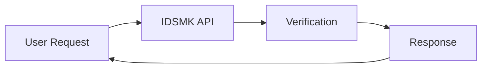

## Overview

IDSMK provides secure identity verification and monitoring services through its intuitive platform at `idsmk.ru`. You manage user identities, detect anomalies, and ensure compliance with minimal setup. The `Main of IDSMK` core handles authentication flows, real-time alerts, and scalable integrations for businesses needing robust security without complexity.

Focus on your operations while IDSMK safeguards identities. Integrate via simple APIs or SDKs, and scale effortlessly as your needs grow.

<Callout kind="info">
  IDSMK supports global compliance standards like GDPR and SOC 2, ensuring your data stays secure.
</Callout>

## Key Features

IDSMK delivers powerful tools to streamline your security workflows. Explore these core capabilities:

<Columns cols={3}>
  <Card title="Secure Verification" icon="shield" href="#verification">
    Verify identities in `<1s` using biometric and document checks. Reduce fraud by `99%`.
  </Card>
  <Card title="Real-Time Monitoring" icon="activity" href="#monitoring">
    Get instant alerts on suspicious activity. Monitor unlimited users across devices.
  </Card>
  <Card title="Easy Integrations" icon="plug" href="#integrations">
    Connect with your stack using REST APIs or SDKs. Supports `+50` platforms out-of-the-box.
  </Card>
</Columns>

## Who Should Use IDSMK

You benefit from IDSMK if you run fintech apps, e-commerce sites, or enterprise platforms handling sensitive user data. Developers appreciate the low-code setup, while security teams value detailed audit logs and customizable rules.

<Callout kind="tip">
  Start with the free tier to test verification flows—no credit card required.
</Callout>

## Quick Start

Get running in minutes. Follow these steps to verify your first identity.

<Steps>
  <Step title="Sign Up" icon="user-plus">
    Create an account at `https://dashboard.example.com/signup`. Note your `{API_KEY}`.
  </Step>
  <Step title="Install SDK" icon="download">
    Choose your language and install the SDK.

    <CodeGroup tabs="JavaScript,Python">
      ```javascript
      npm install idsmk-sdk
      ```
      ```python
      pip install idsmk-sdk
      ```
    </CodeGroup>
  </Step>
  <Step title="Verify Identity" icon="check-circle">
    Send your first request.

    ```javascript
    import { IDSMK } from 'idsmk-sdk';

    const client = new IDSMK({ apiKey: 'YOUR_API_KEY' });
    const result = await client.verify({
      userId: 'user-123',
      document: 'passport.jpg'
    });
    console.log(result.status); // "verified"
    ```
  </Step>
</Steps>

## Next Steps

Dive deeper into IDSMK:

<Columns cols={2}>
  <Card title="Quickstart Guide" icon="book-open" href="/quickstart">
    Complete setup with full examples.
  </Card>
  <Card title="Authentication" icon="lock" href="/authentication">
    Secure your API calls.
  </Card>
  <Card title="Configuration" icon="settings" href="/configuration">
    Customize rules and webhooks.
  </Card>
  <Card title="Changelog" icon="git-branch" href="/changelog">
    Stay updated with releases.
  </Card>
</Columns>

